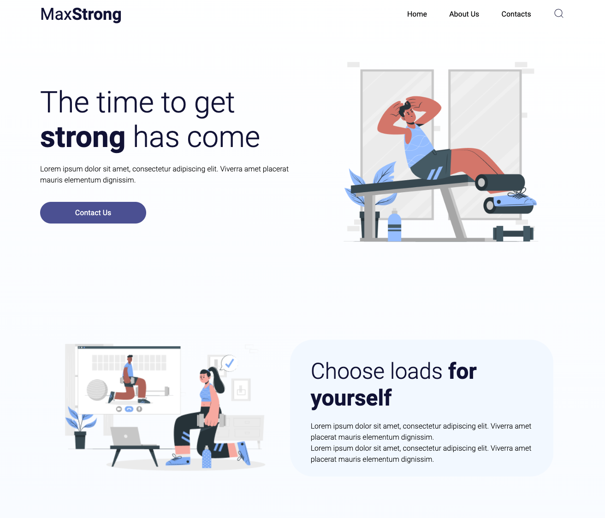
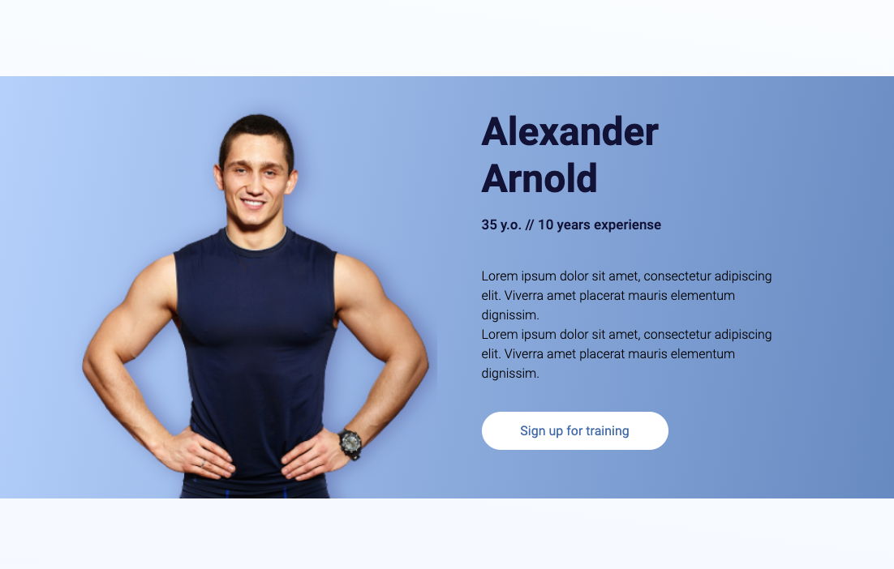
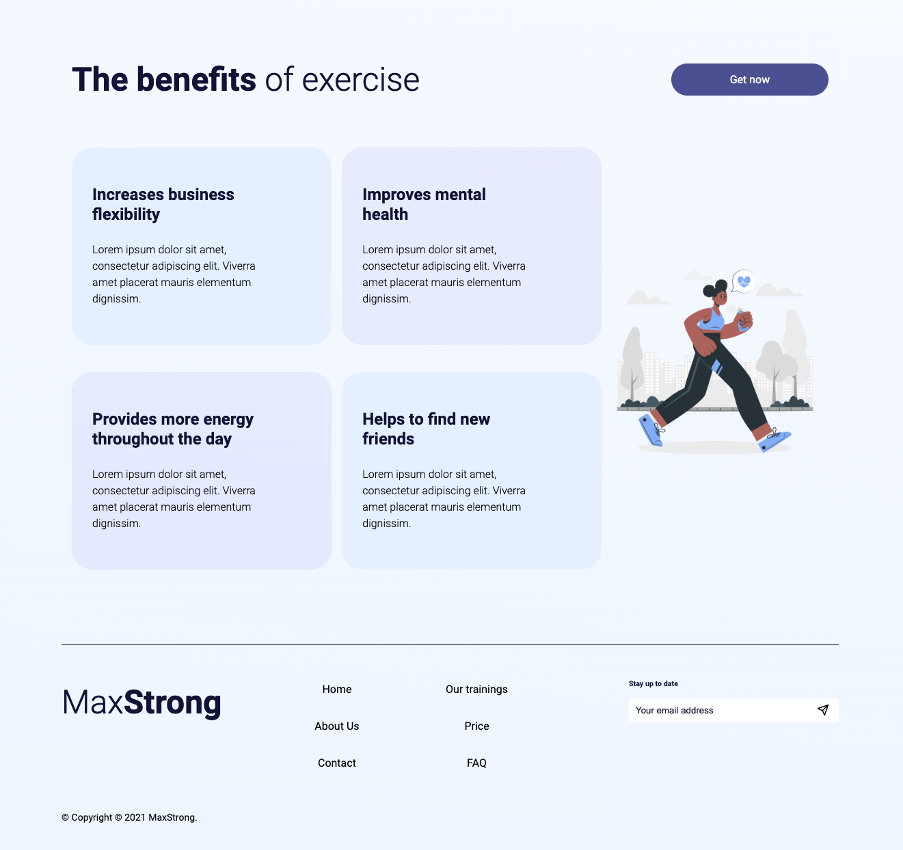
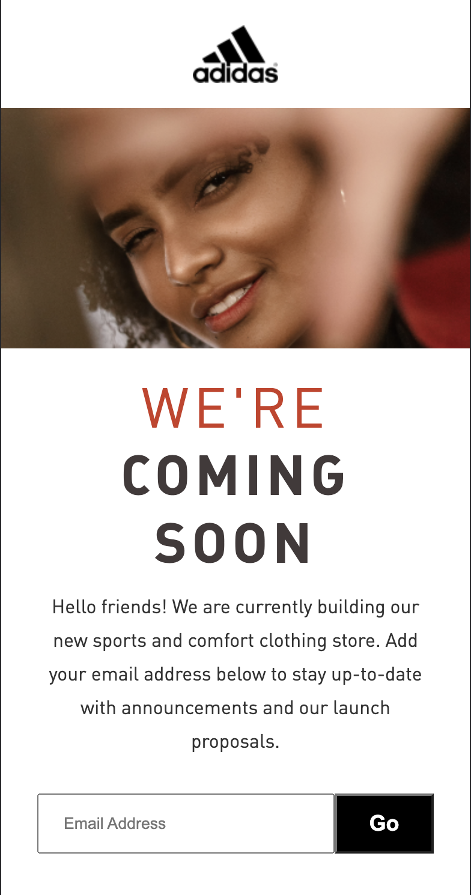
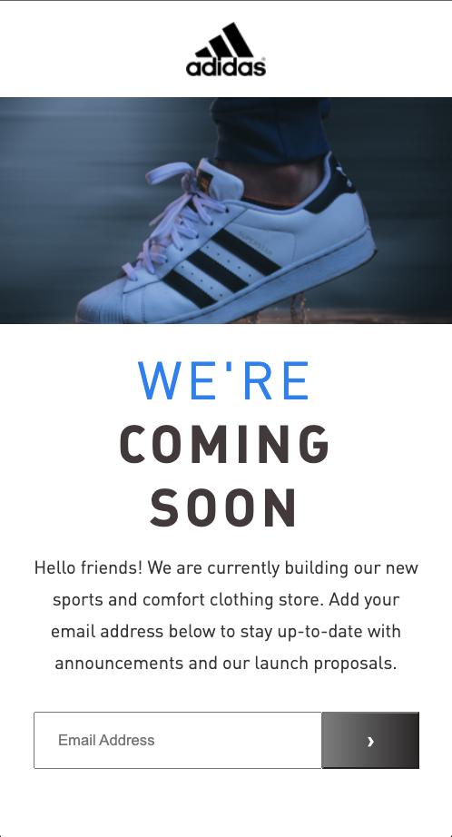
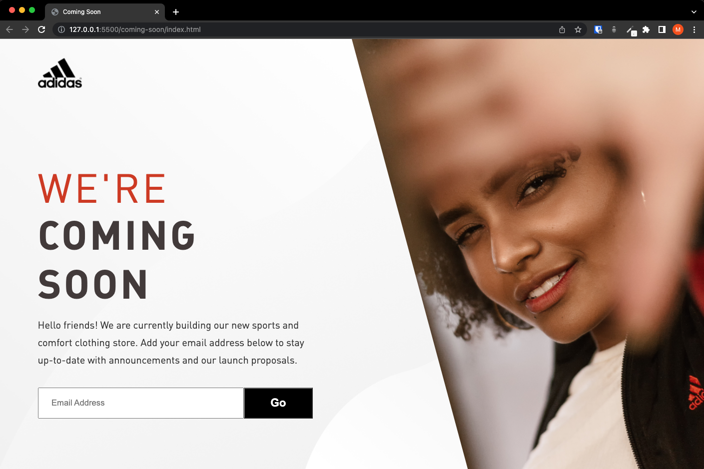
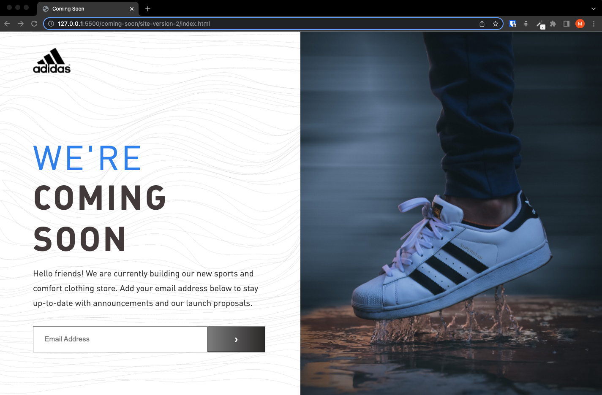
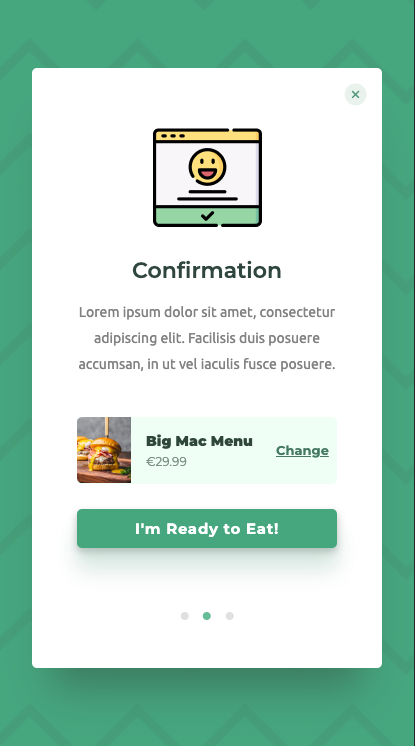
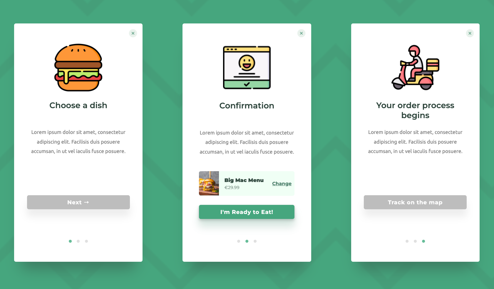
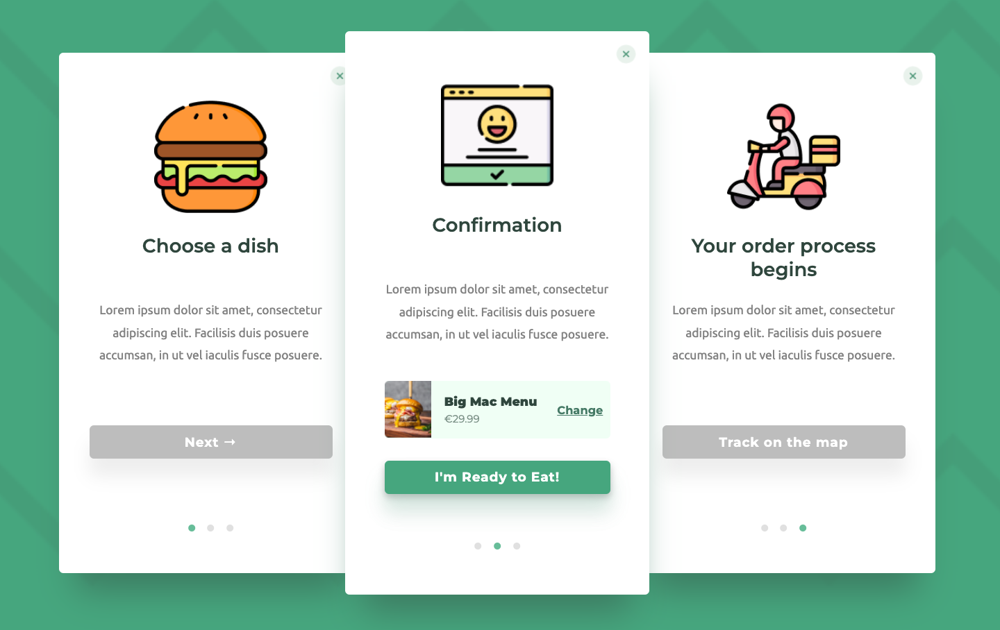

# Landing Page

## Mobile Version

## Desktop Version

    

    

    

  

# Coming Soon Page

## Mobile Versions

    

 

## Desktop Versions

    

 

    

  

# Delivery Status Page

## Mobile Version

 

## Desktop Versions

    

 

  

# freemote-projects
Projects completed during the Freemote Web Development Crash Course.
Built with a mobile first design approach.